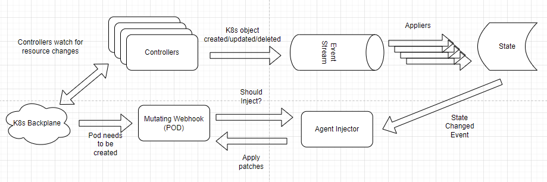
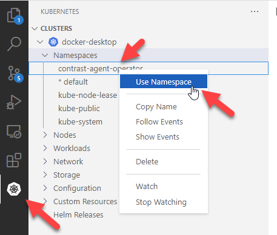
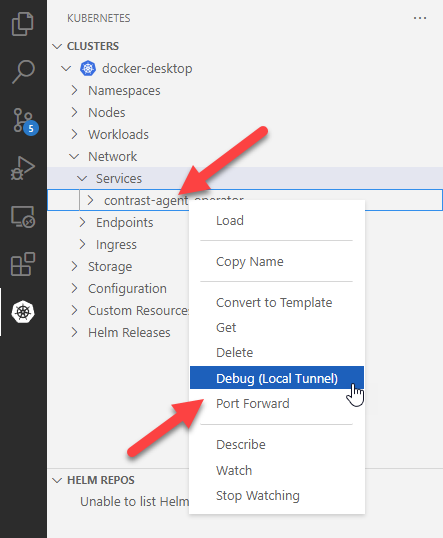
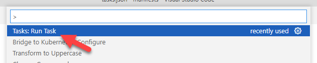
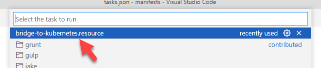

# agent-operator

A K8s operator to inject agents into existing K8s workloads. Images are built in [agent-operator-images](https://github.com/Contrast-Security-Inc/agent-operator-images).

Managed by the .NET team.

For questions, suggestions, bugs, see [#agent-operator](https://contrastsecurityinc.slack.com/archives/C03FNADV430).

Supported Versions:

| Kubernetes Version | OpenShift Version | Supported | End-of-Support |
|--------------------|-------------------|-----------|----------------|
| v1.23              | v4.10             | Yes       | 2023-02-28     |
| v1.22              | v4.9              | Yes       | 2022-10-28     |
| v1.21              | v4.8              | Yes       | 2022-06-28     |

## Artifacts

Builds released into the the `internal` environment are published to our internal container image registry hosted on Azure (which expire after 30 days). Manifest are uploaded as GitHub Action artifacts (which expire after 7 days).

```
contrastdotnet.azurecr.io/agent-operator/agent-operator:0.0.1
contrastdotnet.azurecr.io/agent-operator/agent-operator:0.0
contrastdotnet.azurecr.io/agent-operator/agent-operator:0
contrastdotnet.azurecr.io/agent-operator/agent-operator:latest
```

Builds released into the the `public` environment are are published to DockerHub. Manifest are uploaded to the [GitHub releases page](https://github.com/Contrast-Security-Inc/agent-operator/releases).

```
contrast/agent-operator:1.0.0
contrast/agent-operator:1.0
contrast/agent-operator:1
contrast/agent-operator:latest
```

## Design

Data flow is unidirectional when possible.



## Development

As this is an operator, local development requires the interactions of a K8s cluster.

### Development with Docker Desktop

#### Local K8s

The easiest method to develop "pull" features (features that does not require the back plane to communicate with our app) is using Docker Desktop in K8s mode.

- Ensure Docker Desktop is installed (Enable WSL integration is recommended, for the lightweight containers).
- Ensure Docker Desktop is in Linux Containers mode.
- In Docker Desktop Settings, ensure that "Kubernetes > Enable Kubernetes" is enabled.
- Under the host (not WSL), ensure `cluster-info` looks like:

```
# kubectl cluster-info
Kubernetes control plane is running at https://kubernetes.docker.internal:6443
CoreDNS is running at https://kubernetes.docker.internal:6443/api/v1/namespaces/kube-system/services/kube-dns:dns/proxy
```

With Docker Desktop executing locally, the operator should automatically connect to the local back plane using your local `kubeconfig`.

#### Development with Webhooks

Webhooks or "push" features require the ability for the cluster to contact the running operator. If the operator is running outside of the cluster, this communication can become a problem.

Using the "Bridge to Kubernetes", we can redirect requests to a cluster service to our local machine.

https://docs.microsoft.com/en-us/visualstudio/bridge/bridge-to-kubernetes-vs-code

- Ensure `manifests\install\dev` is deployed into your local cluster.
- Ensure the VS Code extension is installed.
- Select the operator namespace.



- Finally, create a local tunnel from the cluster to your machine. Select the port your local operator instance is running on (for us, port 5001).



After following the prompts and running the generated task, connections for the operator wil be redirected to your local machine.

To run the task:



And select the generated task:


