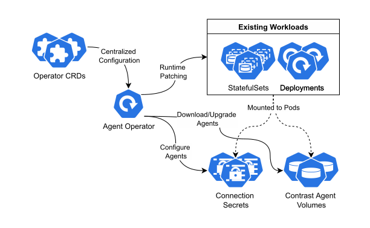

# agent-operator

[](https://hub.docker.com/r/contrast/agent-operator)

A K8s operator to inject agents into existing K8s workloads.

Managed by the Contrast .NET agent team. Images are built from [agent-operator-images](https://github.com/Contrast-Security-OSS/agent-operator-images).



Features:
- Automatic injection of agents into cluster workloads without modifying "golden images" or maintaining base images.
- Management of automatic agent updates.
- Declarative configuration using Kubernetes native objects.
- Centralized agent configuration/connection management across an entire cluster.

## Getting Started

Make sure the operator supports your cluster version.

| Kubernetes Version | OpenShift Version | Operator Version | End-of-Support |
|--------------------|-------------------|------------------|----------------|
| v1.31              |                   | v0.14.0+         | 2025-10-28     |
| v1.30              |                   | v0.14.0+         | 2025-06-28     |
| v1.29              | v4.16             | v0.14.0+         | 2025-02-28     |
| v1.28              | v4.15             | v0.14.0+         | 2024-10-28     |
| v1.27              | v4.14             | v0.14.0+         | 2024-06-28     |
| v1.26              | v4.13             | v0.14.0+         | 2024-02-28     |

To install the latest version of the operator into a cluster, apply the installation YAML containing all the required manifests, including the CRDs and RBACs.

```bash
kubectl apply -f https://github.com/Contrast-Security-OSS/agent-operator/releases/latest/download/install-prod.yaml
```

The operator can also be deployed using Helm - see [contrastsecurity.dev/helm-charts](https://contrastsecurity.dev/helm-charts/).

Further documentation and examples can be found on [docs.contrastsecurity.com](https://docs.contrastsecurity.com/en/agent-operator.html) ([en](https://docs.contrastsecurity.com/en/agent-operator.html)/[jp](https://docs.contrastsecurity.jp/ja/agent-operator.html)).

## Releases

Builds released into the the `public` environment are published to DockerHub and Quay. Manifests are uploaded to the [GitHub releases page](https://github.com/Contrast-Security-OSS/agent-operator/releases).

Releases are tagged using the following format:

```
contrast/agent-operator:1.0.0
contrast/agent-operator:1.0
contrast/agent-operator:1
contrast/agent-operator:latest
```

See [DockerHub tags](https://hub.docker.com/r/contrast/agent-operator/tags) or [Quay tags](https://quay.io/repository/contrast/agent-operator?tab=tags) for a list of all available tags.

## Contributing

See [./CONTRIBUTING.md](./CONTRIBUTING.md).

## Security

See [./SECURITY.md](./SECURITY.md).
