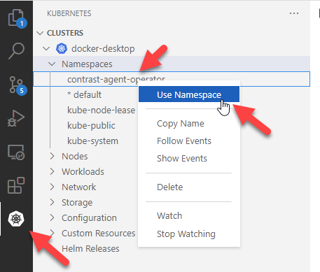
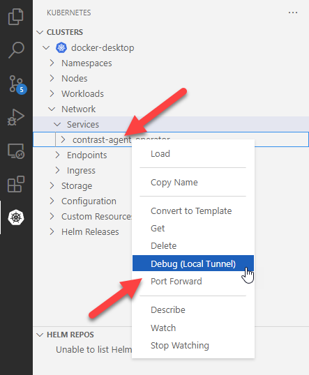
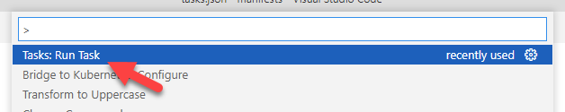
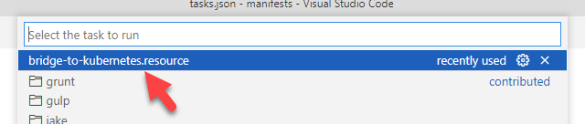

# Development

## Building the Operator

> Make sure to restore the submodules in the `./vendor` directory and you have the latest .NET LTS installed!

The Contrast Agent Operator is a standard .NET application and can be built as such.

```
dotnet build
```

And when everything is ready,

```
dotnet run
```

## Running the Operator Locally

As this is an operator, local development requires the interactions of a K8s cluster.

For everything to work correctly, make sure you have the `contrast-agent-operator` namespace created (either manually or by deploying `./manifests/install/dev`). This allows the operator to create the required resources in its namespace (e.g. TLS certificates).

### Development with Docker Desktop

The easiest method to develop "pull" features (features that does not require the back plane to communicate with our app) is using Docker Desktop in K8s mode.

- Ensure Docker Desktop is installed (Enable WSL integration is recommended, for the lightweight containers).
- Ensure Docker Desktop is in Linux Containers mode.
- In Docker Desktop Settings, ensure that "Kubernetes > Enable Kubernetes" is enabled.
- Under the host (not WSL), ensure `cluster-info` looks like:

```
# kubectl cluster-info
Kubernetes control plane is running at https://kubernetes.docker.internal:6443
CoreDNS is running at https://kubernetes.docker.internal:6443/api/v1/namespaces/kube-system/services/kube-dns:dns/proxy
```

With Docker Desktop executing locally, the operator should automatically connect to the local back plane using your local `kubeconfig`.

### Development with Webhooks

Webhooks or "push" features require the ability for the cluster to contact the running operator. If the operator is running outside of the cluster, this communication can become a problem.

Using the "Bridge to Kubernetes", we can redirect requests to a cluster service to our local machine.

https://docs.microsoft.com/en-us/visualstudio/bridge/bridge-to-kubernetes-vs-code

- Ensure `manifests\install\dev` is deployed into your local cluster.
- Ensure the VS Code extension is installed.
- Select the operator namespace.



- Finally, create a local tunnel from the cluster to your machine. Select the port your local operator instance is running on (for us, port 5001).



After following the prompts and running the generated task, connections for the operator wil be redirected to your local machine.

To run the task:



And select the generated task:



## Running the Tests

There are currently two test projects, one for Unit Tests, the other for Functional tests. Both are run in CI - unit tests during the container image build, and functional tests against every K8s version we support.

Running the unit tests requires no dependency setup, but to run the functional tests locally, some setup is required.

```bash
# Build a local image of the operator (this of course only works if using Docker Desktop with a shared Docker image cache).
docker build . -t local/agent-operator:latest

# Make sure any development resources are gone.
kubectl delete -k ./manifests/install/dev/

# Install the operator in the testing namespace.
kubectl apply -k ./manifests/install/testing/

# Install the required test fixtures.
kubectl apply -k ./manifests/examples/testing/
```

Afterwards, the functional tests are ready to be ran.
